

# PA4 Submission: TaskFlow Pipeline

Copy this file to <code style="color:#111827;background:#ddd6fe;padding:2px 4px;border-radius:4px;">SUBMISSION.md</code>. Put every screenshot in <code style="color:#111827;background:#ddd6fe;padding:2px 4px;border-radius:4px;">docs/</code>, embed it under the correct task, and write a short description below each image explaining what it proves. The grader should not need any file outside this repository.

## Student Information

| Field | Value |
|---|---|
| Name | Muhammad Abdullah Hanzalah |
| Roll Number | 24030006 |
| GitHub Repository URL | `https://github.com/abdullahhanzalah/CS487-PA4` |
| Resource Group | `rg-sp26-24030006` |
| Assigned Region | `Sweden Central` |

## Evidence Rules

- Use relative image paths, for example: ``.
- Every image must have a 1-3 sentence description below it.
- Azure Portal screenshots must show the resource name and enough page context to identify the service.
- CLI screenshots must show the command and output.
- Mask secrets such as function keys, ACR passwords, and storage connection strings.

## Task 1: App Service Web App (15 points)

### Evidence 1.1: Forked Repository

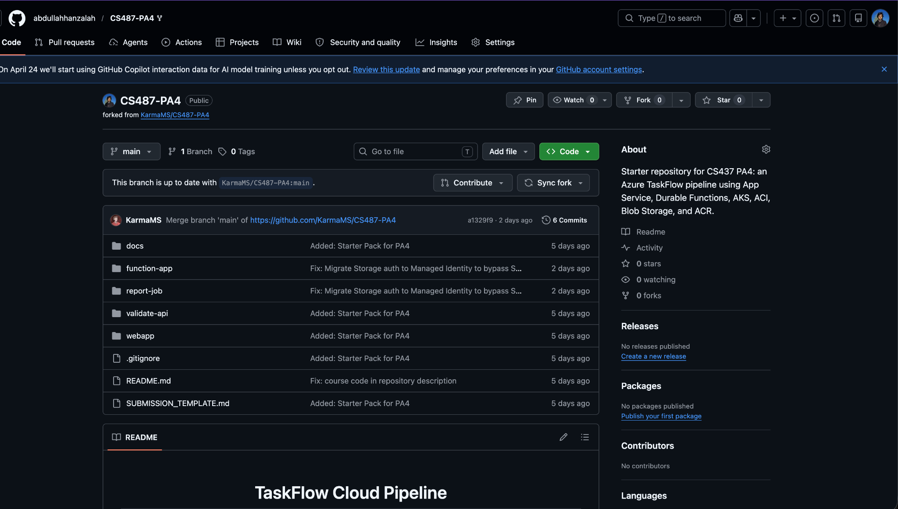

Description: This screenshot shows my working fork, `abdullahhanzalah/CS487-PA4`, which I used throughout the PA. It contains the starter structure plus the deployment, Kubernetes, Function App, and submission updates completed during the assignment.

### Evidence 1.2: App Service Overview

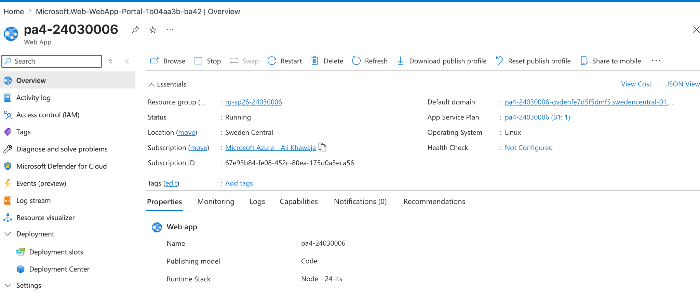

Description: This Azure portal overview shows Web App `pa4-24030006` in resource group `rg-sp26-24030006`, region Sweden Central, and `Running` state. The portal provisioned the Linux runtime as `Node - 24-lts`, and the live site URL is `https://pa4-24030006-gvdehfe7d5f5dmf5.swedencentral-01.azurewebsites.net/`.

### Evidence 1.3: Deployment Center / GitHub Actions

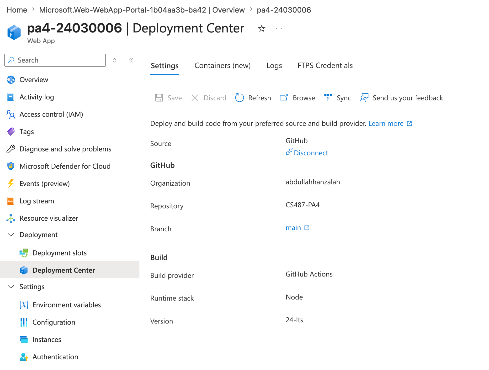

Description: This Deployment Center view shows the Web App connected to my GitHub fork `abdullahhanzalah/CS487-PA4` on the `main` branch and using GitHub Actions as the build provider. During debugging, the generated workflow was replaced with a corrected workflow that builds from `webapp/`, but this screenshot captures the GitHub-to-App-Service linkage required by the task.

### Evidence 1.4: Live Web UI

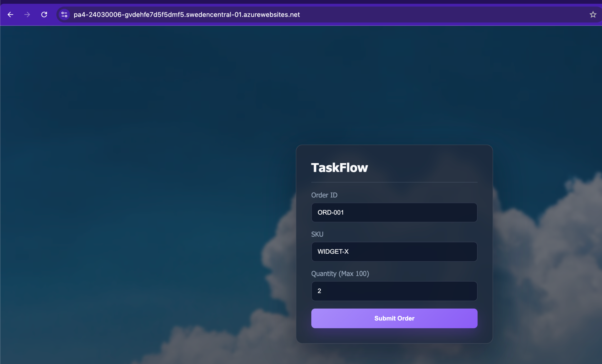

Description: This browser screenshot shows the TaskFlow frontend loading from the live App Service domain. It proves the frontend bundle deployed successfully and is being served publicly by Azure App Service.

### Evidence 1.5: Web App Application Settings

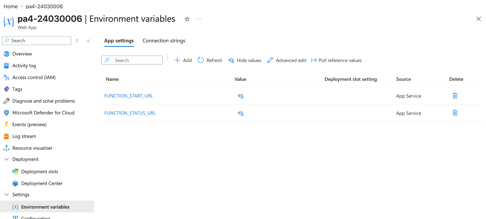

Description: This Web App environment-variables screen shows `FUNCTION_START_URL` and `FUNCTION_STATUS_URL` configured. These are the only backend settings the frontend needs, and their actual values were populated later once the Function App starter and status endpoints were available.

---

## Task 2: Azure Container Registry (15 points)

### Evidence 2.1: ACR Overview

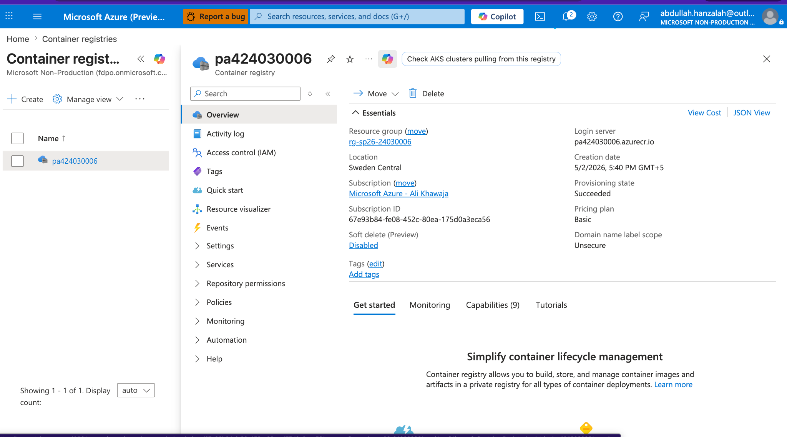

Description: This portal overview shows Azure Container Registry `pa424030006` in resource group `rg-sp26-24030006`, located in Sweden Central. The registry SKU is `Basic`, which was sufficient for storing the three course images used in this PA.

### Evidence 2.2: Docker Builds

**`validate-api` build**

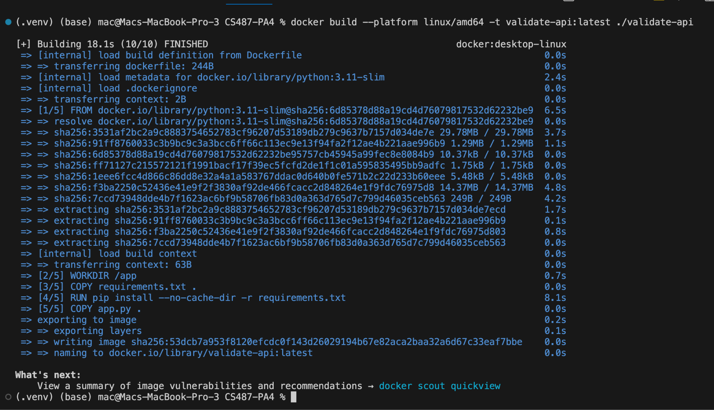

**`report-job` build**

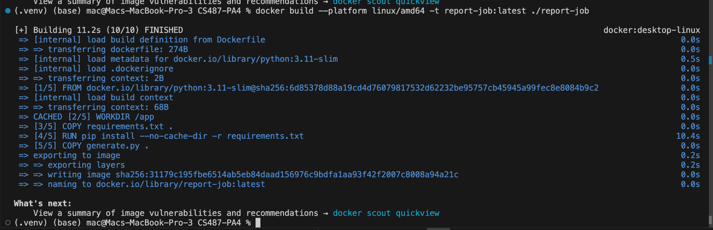

**`func-app` build**

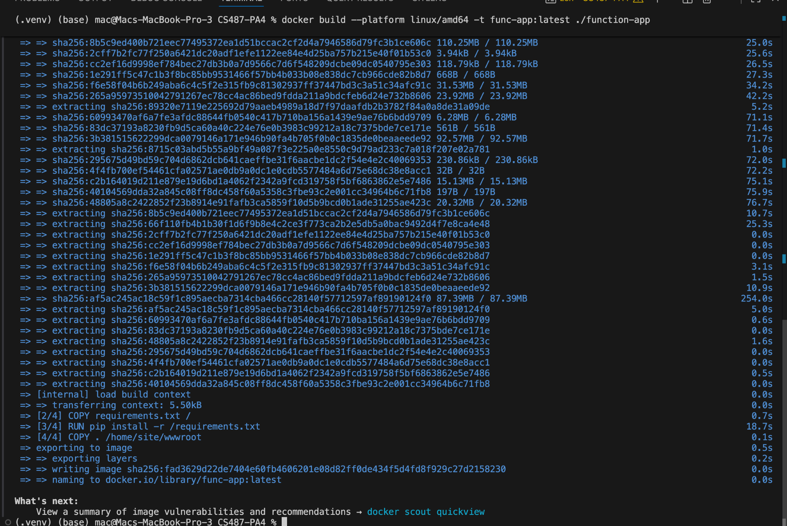

**Validator local test**

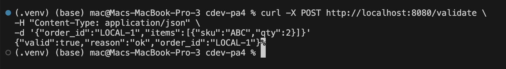

Description: These terminal screenshots show successful local Docker builds for `validate-api`, `report-job`, and `func-app`. The images were built from the `/validate-api`, `/report-job`, and `/function-app` folders respectively, and on Apple Silicon the builds were done with `linux/amd64` where required by the Azure base images.

### Evidence 2.3: ACR Repositories

**Docker push output**

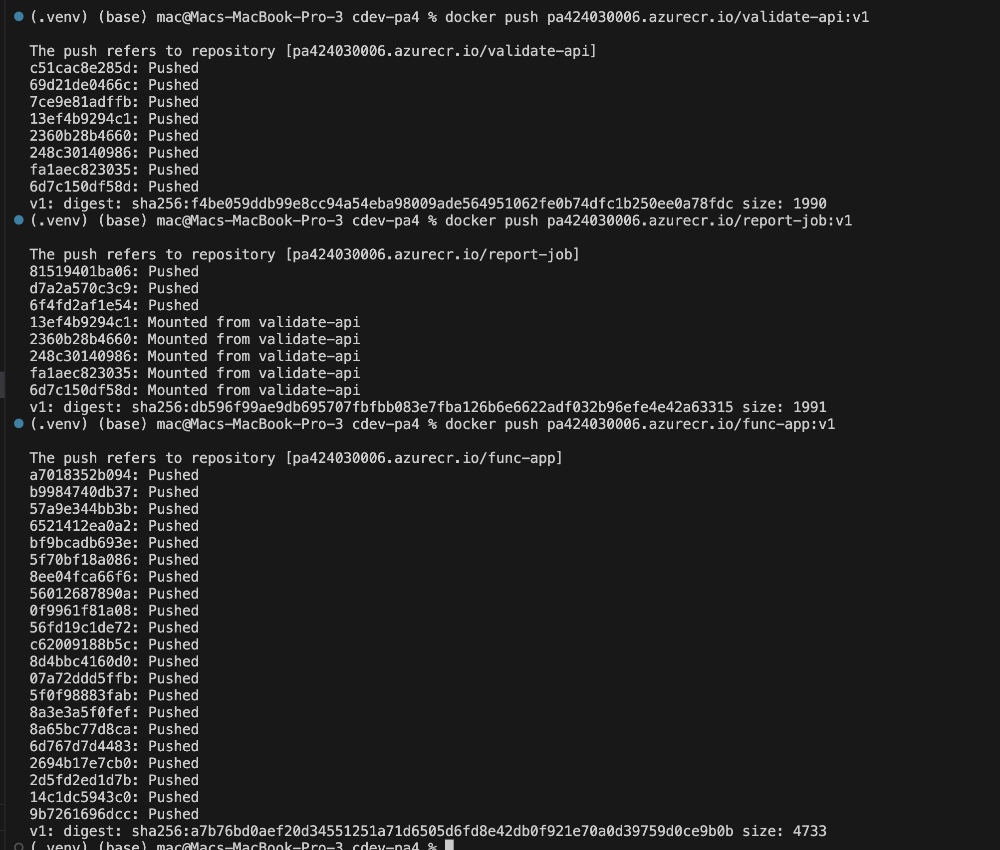

**Repository listing**

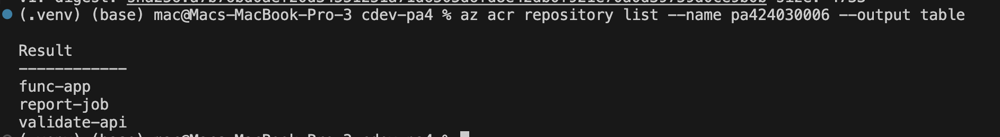

Description: The push logs show the `v1` images being pushed to `pa424030006.azurecr.io`, and the repository listing confirms that `validate-api`, `report-job`, and `func-app` exist in the registry. At Task 2 time the required deliverables were `validate-api:v1`, `report-job:v1`, and `func-app:v1`; the Function App image was later updated to `v2` only after the signed-report-URL fix.

---

## Task 3: Durable Function Implementation (12 points)

### Evidence 3.1: Completed Function Code

[function_app.py](function-app/function_app.py)

Description: The completed Durable Functions implementation is in `function-app/function_app.py`. The orchestrator reads the order input, calls `validate_activity`, returns `{"status":"rejected"}` when validation fails, and otherwise calls `report_activity` to run the one-shot report container and return the final report URL. In the final version, that report URL is a signed Blob SAS URL so the generated PDF can be opened without enabling anonymous blob access.

### Evidence 3.2: Local Function Handler Listing

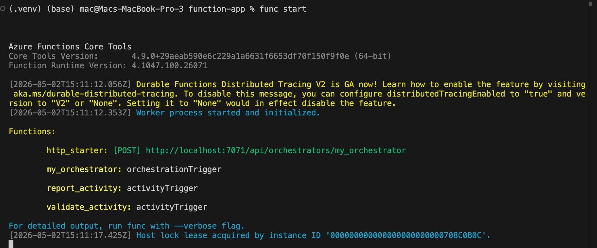

Description: This `func start` output shows the local Functions runtime discovering all four handlers: `http_starter`, `my_orchestrator`, `validate_activity`, and `report_activity`. That confirms the decorators and entry points were wired correctly before cloud deployment; later validator-backed execution evidence appears again in Task 5.4 and Task 7.2.

### Evidence 3.3: Local `validate_activity` Smoke Test After Task 5

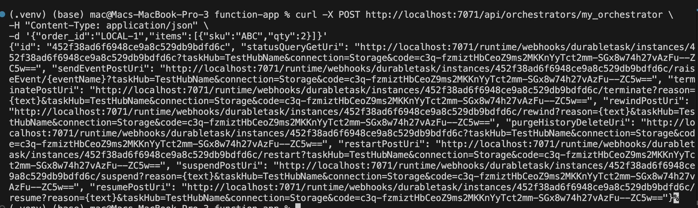

Description: This local `curl` call to `http://localhost:7071/api/orchestrators/my_orchestrator` returns an orchestration instance ID and `statusQueryGetUri` after `VALIDATE_URL` was pointed at the deployed AKS validator. It shows the local Durable Functions host could start the orchestration and reach the validator-backed path required by the Task 3.3 post-Task-5 smoke test.

---

## Task 4: Function App Container Deployment (8 points)

### Evidence 4.1: Function App Container Configuration

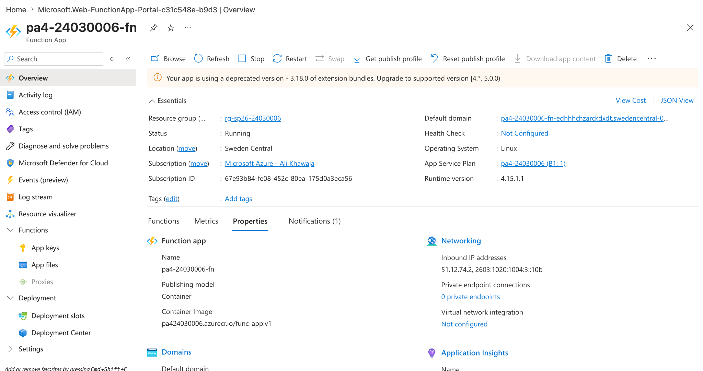

Description: This overview shows Function App `pa4-24030006-fn` in `Running` state and using the ACR image `pa424030006.azurecr.io/func-app:v1`. This screenshot captures the original Task 4 container deployment; later in the project the Function App was redeployed with `func-app:v2` after the signed-report-URL fix.

### Evidence 4.2: Functions List in Azure Portal

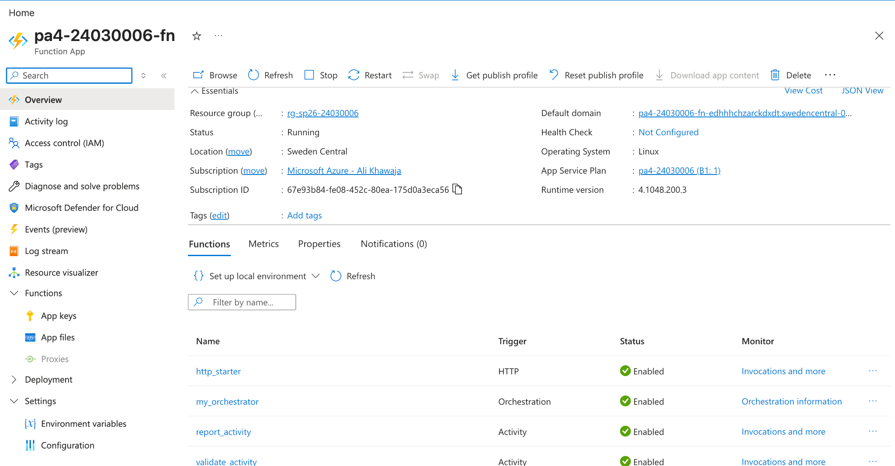

Description: This Function App portal view shows all four registered functions: `http_starter`, `my_orchestrator`, `report_activity`, and `validate_activity`. It confirms that Azure indexed the deployed container correctly and exposed the required handlers in the portal.

### Evidence 4.3: Orchestration Smoke Test

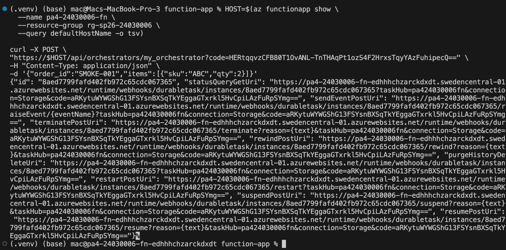

Description: This starter `curl` call returns an orchestration `id`, `statusQueryGetUri`, and the related terminate/rewind endpoints. That proves the HTTP starter endpoint is reachable and that Durable Functions is successfully creating orchestration instances in Azure.

### Evidence 4.4: Expected Failed Status Before Downstream Wiring

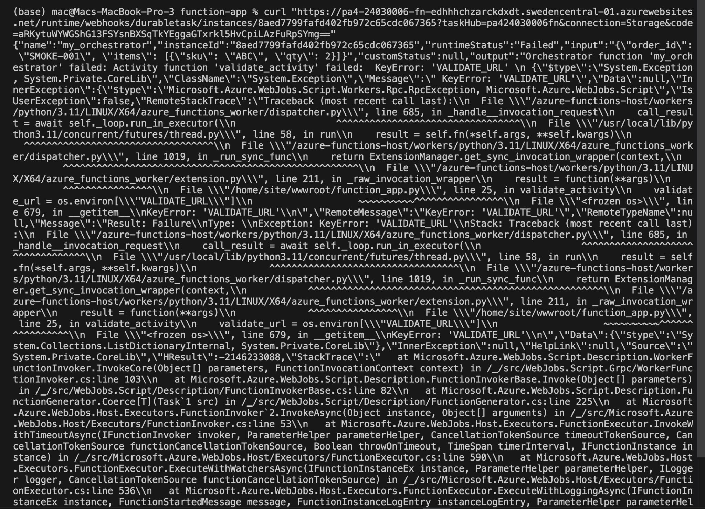

Description: The status query shows an expected failure caused by `KeyError: 'VALIDATE_URL'`. At this point in the assignment the Function App container was running, but the downstream AKS validator URL had not been configured yet, so this error was the correct intermediate state.

---

## Task 5: AKS Validator (15 points)

### Evidence 5.1: AKS Cluster

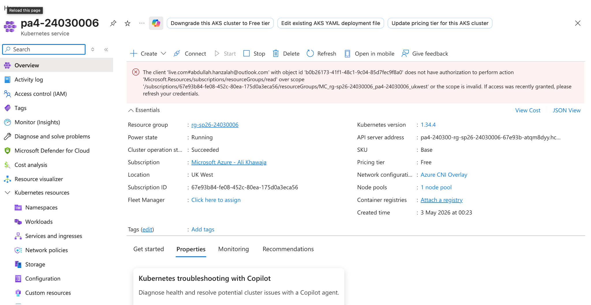

Description: This AKS overview shows cluster `pa4-24030006` in resource group `rg-sp26-24030006`, region UK West, on Kubernetes `1.34.4`, with `1 node pool`. The banner is only an RBAC warning for the managed node resource group; the cluster itself is healthy with `Power state: Running` and `Cluster operation status: Succeeded`.

### Evidence 5.2: Kubernetes Nodes and Pods

**Cluster node**

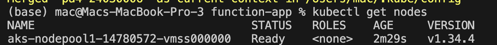

**Validator pod**

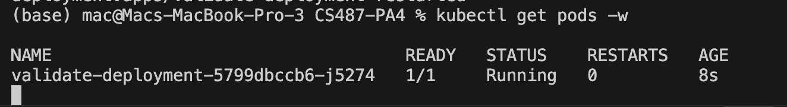

Description: `kubectl get nodes` shows one Ready AKS node, and `kubectl get pods -w` shows the validator pod `validate-deployment-5799dbccb6-j5274` reaching `1/1 Running`. That proves the validator deployment was scheduled successfully and became healthy on the cluster.

### Evidence 5.3: Kubernetes Service

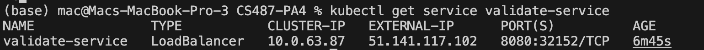

Description: This service listing shows `validate-service` exposed as a `LoadBalancer` with external IP `51.141.117.102` and service port `8080`. That is the public validator endpoint used later by the Function App: `http://51.141.117.102:8080/validate`.

### Evidence 5.4: Validator API Tests

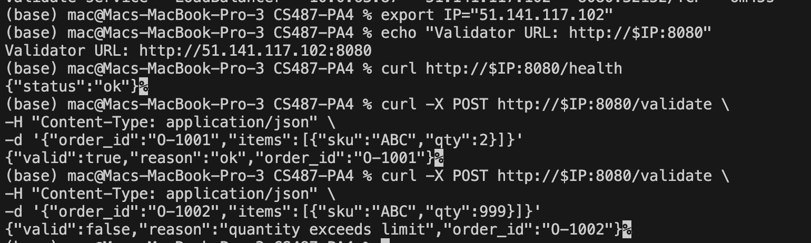

Description: The screenshot shows a successful `/health` response, a valid `/validate` call returning `{"valid":true,"reason":"ok"}`, and an invalid `/validate` call rejecting an order whose quantity exceeds the limit. This proves the validator enforces the course rule that orders with `qty > 100` must be rejected before report generation.

### Evidence 5.5: Function App `VALIDATE_URL`

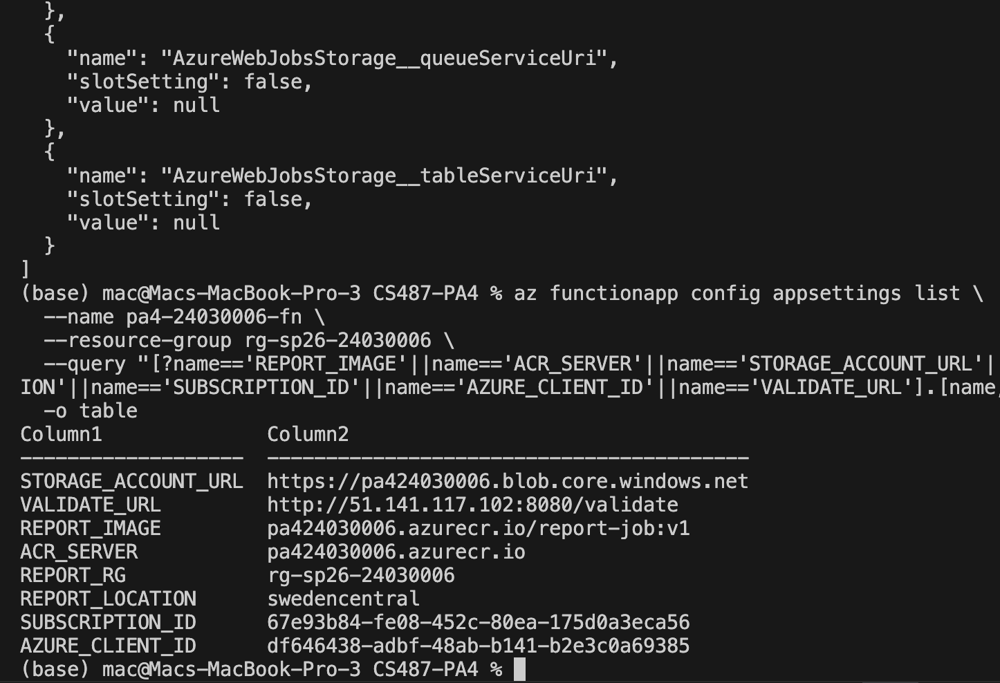

Description: This Function App app-settings query includes `VALIDATE_URL=http://51.141.117.102:8080/validate`, which is the AKS validator endpoint. `validate_activity` reads this setting and sends the order payload to the AKS service before the orchestration decides whether it should continue to report generation.

---

## Task 6: ACI Report Job (15 points)

### Evidence 6.1: Blob Container

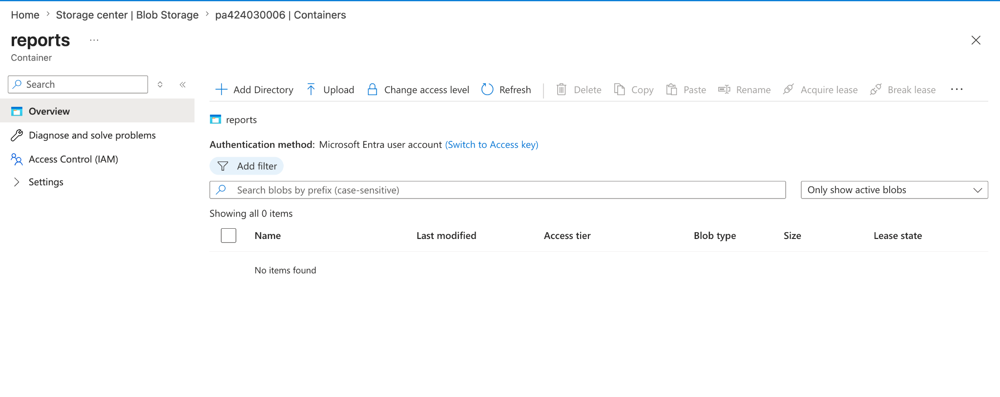

Description: This portal screenshot shows the `reports` blob container inside storage account `pa424030006`. All generated PDF reports are uploaded into this container by the report job.

### Evidence 6.2: Manual ACI Run

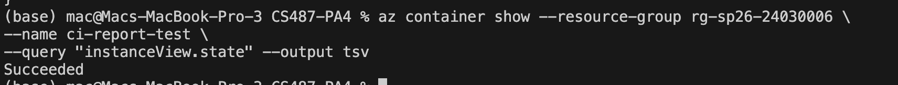

Description: `az container show` reports the manual test container `ci-report-test` in final state `Succeeded`. That is the expected end state for this one-shot batch container because it generates a single PDF, uploads it, and exits instead of staying alive like a service.

### Evidence 6.3: ACI Logs

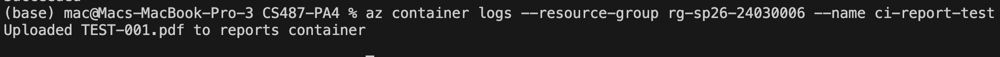

Description: The container logs show the report job generating the PDF and uploading `TEST-001.pdf` into Blob Storage. This confirms that the report image executed correctly with the supplied environment variables and storage access path.

### Evidence 6.4: Generated PDF

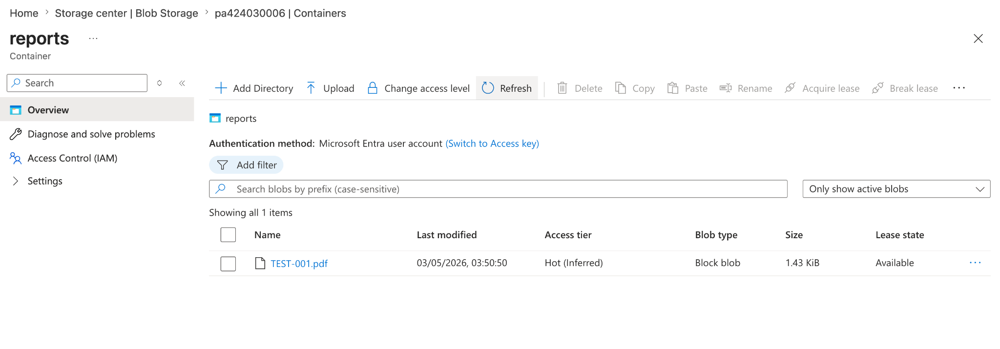

Description: The blob listing shows `TEST-001.pdf` present in the `reports` container after the manual ACI run finished. That proves the ACI job wrote its output artifact to Azure Blob Storage successfully.

### Evidence 6.5: Function App Managed Identity and IAM

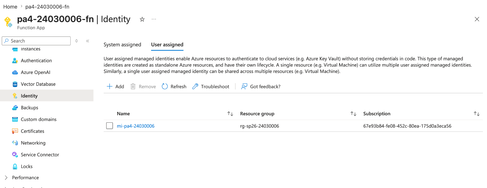

Description: This screenshot shows the user-assigned managed identity `mi-pa4-24030006` attached to Function App `pa4-24030006-fn`. That is the identity that was granted the downstream Azure access used in this PA, including creating and deleting ACI report jobs and accessing storage without embedding long-lived credentials in code.

### Evidence 6.6: Report App Settings

Description: This app-settings query confirms that the Function App has `REPORT_IMAGE`, `ACR_SERVER`, `STORAGE_ACCOUNT_URL`, `REPORT_RG`, `REPORT_LOCATION`, `SUBSCRIPTION_ID`, `AZURE_CLIENT_ID`, and `VALIDATE_URL` configured. Together these settings tell `report_activity` which image to run, where to create the temporary ACI container group, how to authenticate, and where the generated PDF should be uploaded.

---

## Task 7: End-to-End Pipeline (15 points)

### Evidence 7.2: Happy Path UI

**Before submit**

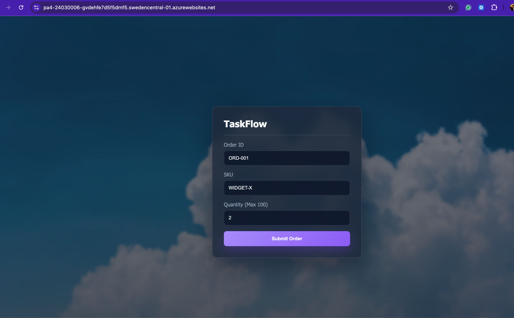

**Running status**

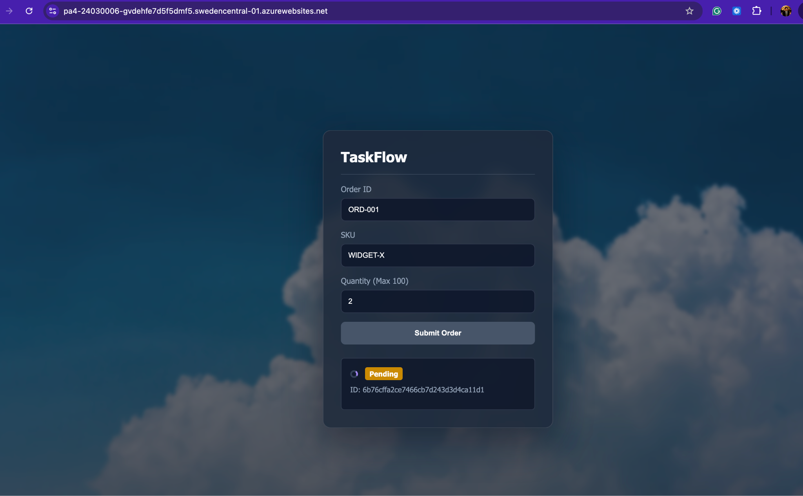

**Completed status**

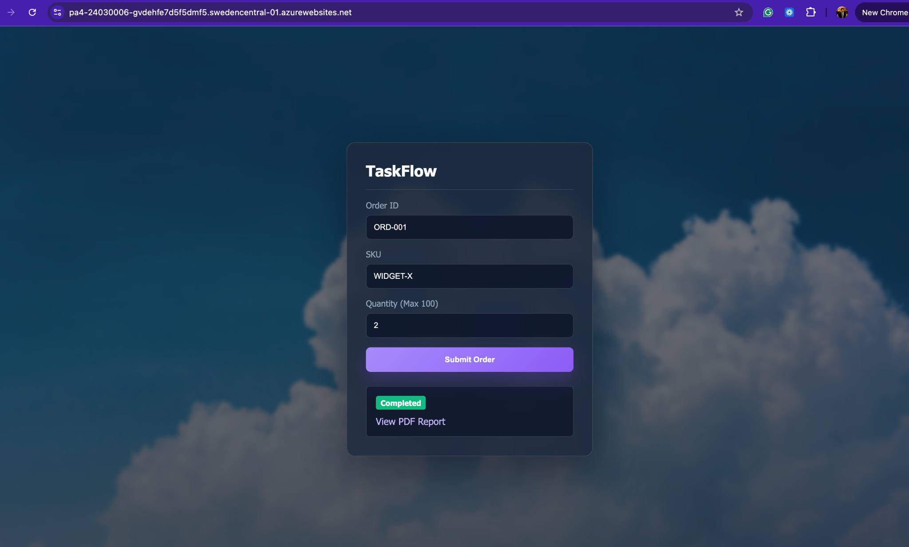

**Opened PDF**

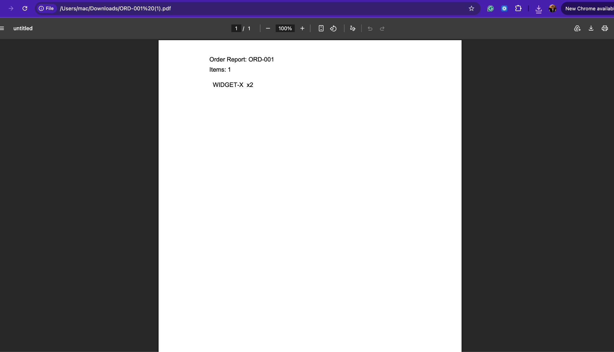

Description: These screenshots show the full happy path for order `ORD-001`: the valid payload `ORD-001 / WIDGET-X / qty 2`, the `Pending` status with orchestration ID, the `Completed` status with the report link, and the opened PDF itself. Because the validator accepted the order, the workflow produced a signed report URL and the generated PDF opened successfully in the browser.

**Backend Participation**

**Function App live log stream: starter, orchestrator, and validation**

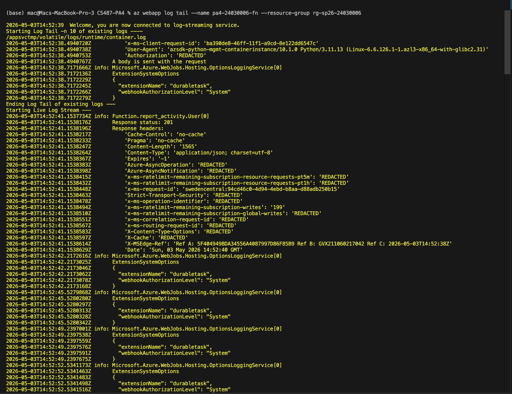

**Function App live log stream: report activity, blob upload, and ACI cleanup**

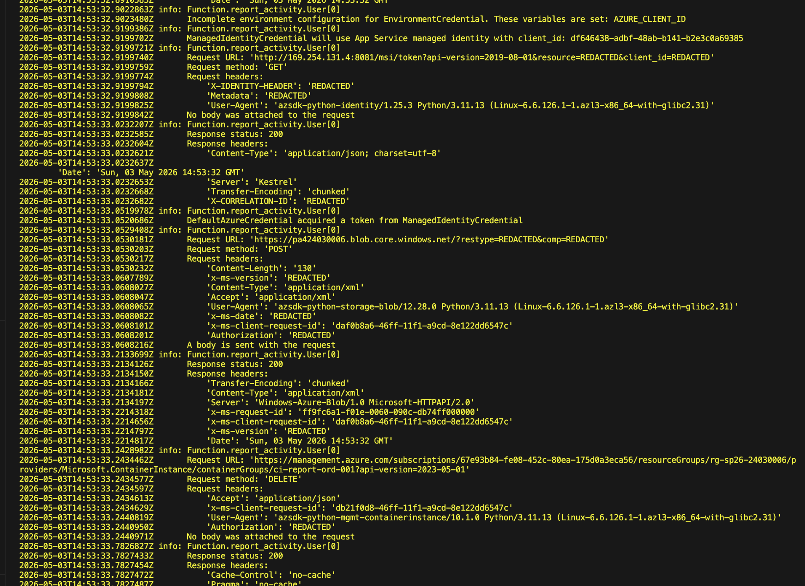

**Function App live log stream: Orchestrator Execution**

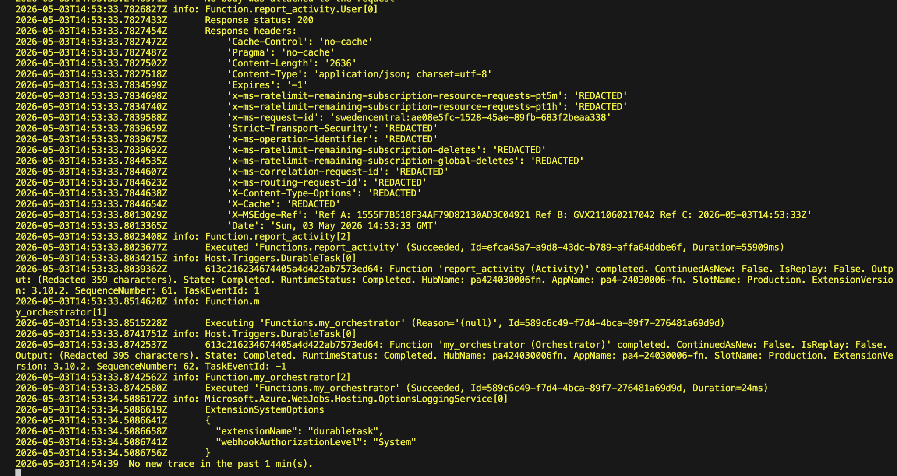

**ACI Spawn evidence**

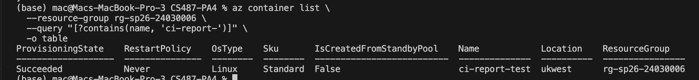

**Blob storage evidence**

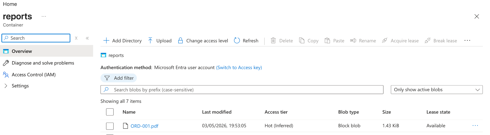

**AKS validator evidence**

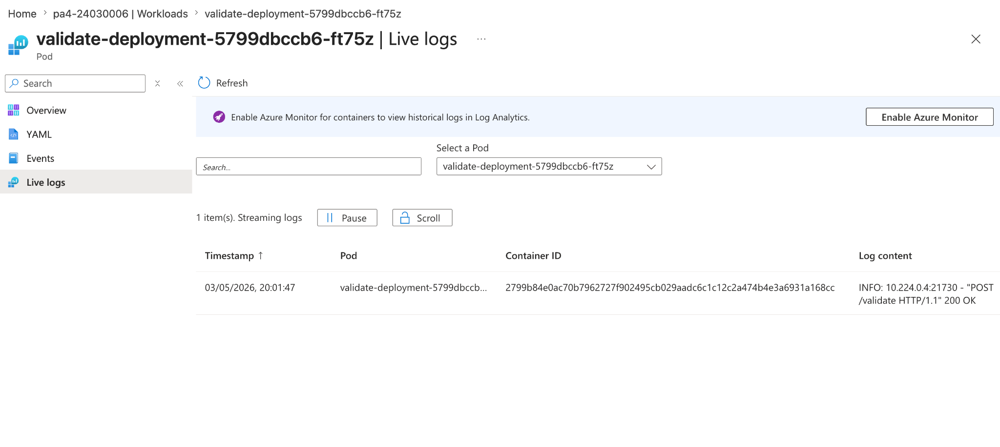

Description: The same happy-path order `ORD-001` can be traced across all backend services: the Function App log shows `http_starter`, `my_orchestrator`, `validate_activity`, and `report_activity`; the report log shows the temporary `ci-report-ord-001` container group being managed and the PDF upload completing; the AKS pod log shows `POST /validate HTTP/1.1 200 OK`; and the `reports` container contains `ORD-001.pdf`. Application Insights resource creation was blocked by Azure RBAC in this subscription, so the Function App invocation evidence here uses the TA-approved live log stream instead of the portal Invocations view.

### Evidence 7.3: Reject Path UI

**Rejected order in the UI**

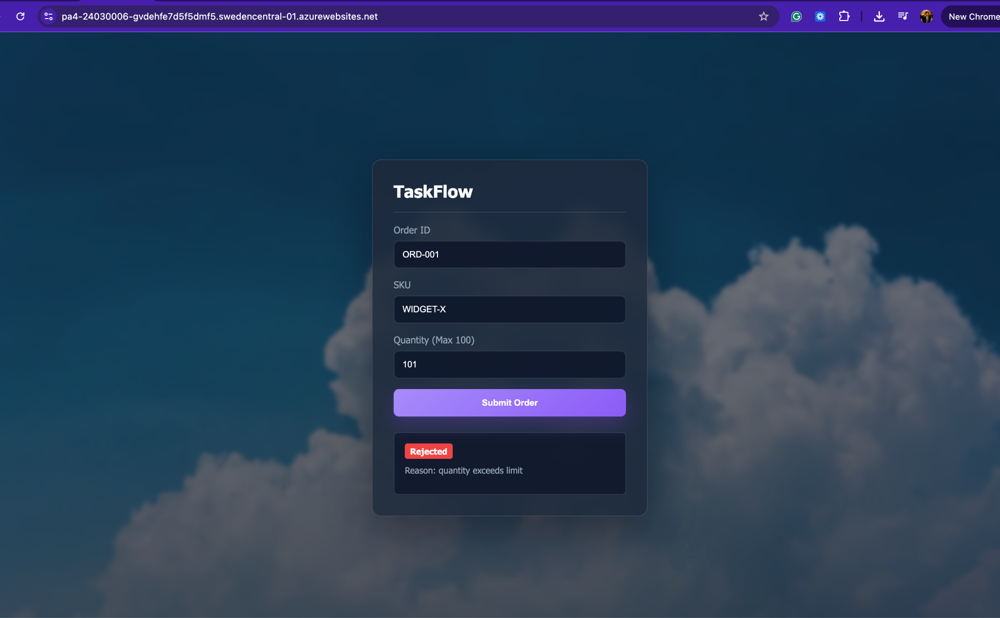

**No report container created**

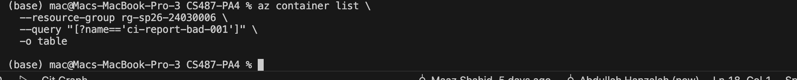

**Rejected orchestration output**

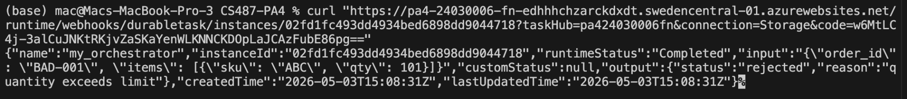

Description: The invalid order `BAD-001` with quantity `101` is rejected in the UI, the orchestration status JSON returns `{"status":"rejected","reason":"quantity exceeds limit"}`, and `az container list` shows no `ci-report-bad-001` container group. This proves the workflow stops immediately after validation failure and does not launch the report ACI for rejected orders.

### Evidence 7.4: Resource Group Overview

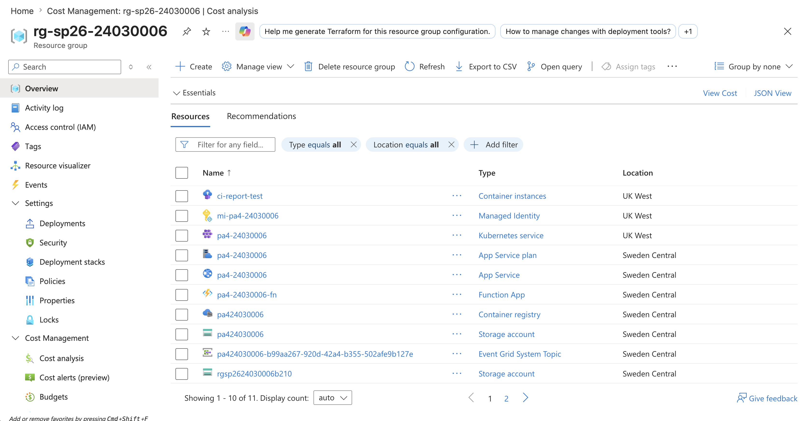

Description: This Azure portal resource-group overview shows the deployed TaskFlow resources inside `rg-sp26-24030006`, including the AKS cluster, managed identity, App Service plan, Web App, Function App, ACR, storage accounts, and related resources. It serves as the final inventory screenshot requested by the manual for the end-to-end section.

---

## Task 8: Write-up and Architecture Diagram (5 points)

### Evidence 8.1: Architecture Diagram

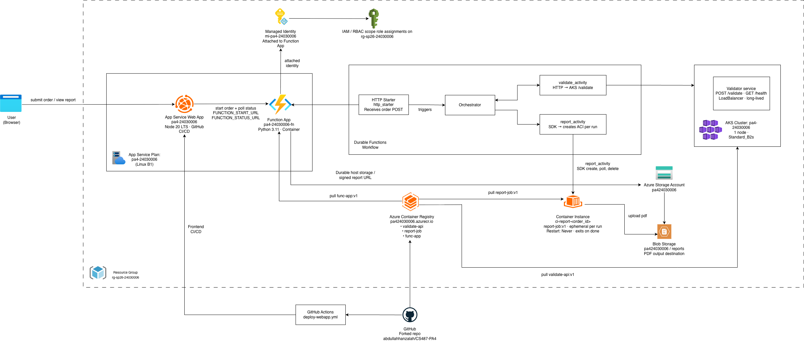

Description: This architecture diagram shows the final deployed TaskFlow solution committed in `docs/architecture_diagram.png`. It includes the manual’s required relationships: GitHub Actions deploying the frontend to App Service, the Web App calling the Function App for order start and status polling, the Function App calling AKS for validation, the Function App creating an ephemeral per-run ACI report container, the report container writing the PDF to Blob Storage, ACR supplying images to the Function App, AKS, and ACI, and the managed-identity / IAM relationship tied to resource group `rg-sp26-24030006`.

### Question 8.2: Service Selection

**App Service**

App Service was the right home for the frontend because TaskFlow needs a stable public website with managed HTTPS, a default hostname, and simple GitHub-based deployment. In this PA, a single Linux Basic B1 plan was enough to host the React UI, so the operational overhead stayed much lower than if the frontend were containerized inside Kubernetes. App Service also gave us a clean place to wire only two settings into the UI: the Function start URL and the status URL. Cost-wise it was predictable because the web tier stayed on a small fixed plan rather than scaling a larger cluster.

**Durable Functions**

Durable Functions was the right control plane because the workflow is stateful and multi-step: validate first, then create an ACI, wait for it, and return a final report URL. The orchestrator automatically persisted state in function host storage and exposed a status endpoint, which made it easy for the web app to poll progress without keeping one long HTTP request open. That operational model matched the real behavior of this PA, where the report step can take much longer than the validator. It was also cost-efficient because the platform only needed short executions around checkpoints instead of a permanently running custom workflow service.

**Azure Kubernetes Service (AKS)**

AKS was the right tool for the validator because the validator behaves like a small always-on API with a stable `LoadBalancer` endpoint, health checks, logs, and a deployment/service model that fits a long-lived HTTP workload. In our deployment, AKS kept one `Standard_B2s` node running, which meant the validator stayed immediately available even when no orders were arriving. That is the main tradeoff: AKS gives stronger service semantics and easier replica-based scaling, but it also keeps charging while idle because the node still exists. For TaskFlow, that was acceptable because validation is the always-on piece of the pipeline.

**Azure Container Instances (ACI)**

ACI was the right tool for the report generator because the report job is ephemeral and one-shot rather than a permanent API. Each valid order creates a container, generates exactly one PDF, uploads it to Blob Storage, and then the Function App deletes the container group, so the operational model is per-run instead of always-on. That keeps the report step isolated and avoids managing another Kubernetes workload for batch processing. Cost-wise, ACI is a better fit than AKS for this role because billing follows actual runtime instead of keeping idle cluster capacity reserved.

### Question 8.3: ACI vs AKS

- When AKS is idle for 10 minutes, the validator pod and its public `LoadBalancer` service still remain provisioned and the `Standard_B2s` node keeps running. The cluster is still ready to answer `/validate` immediately, but the cost does not fall to zero because the node is continuously allocated.

- In this pipeline, "idle" for ACI means there is no report container alive at all between valid orders. After `report_activity` sees that a report container succeeded, it deletes the container group, so there is no warm instance waiting for work.

- If a malicious user spammed the Submit button 1000 times in a minute, ACI would create the largest incremental cost. The AKS validator already sits on a fixed node, so its baseline cost is mostly steady, but ACI would try to spin up one report container per valid order and bill each of those executions separately. Rejected orders would short-circuit before ACI, but a flood of valid orders would make the report tier the most expensive part of the pipeline.

### Question 8.4: Durable Functions vs Plain HTTP

Using two plain HTTP-triggered functions for the same workflow would make the system much harder to operate because the request spans validation, ACI creation, waiting, blob upload, and cleanup. Durable Functions solves the timeout problem by letting the orchestration persist state and expose a status URL instead of forcing one caller to stay connected for the entire end-to-end run. It also solves state persistence and correlation, because the orchestration ID and intermediate results are tracked by the framework rather than by custom tables or ad hoc JSON blobs. Finally, retry-on-failure is safer with Durable Functions: if validation succeeds but report generation fails, the workflow can be retried from a known state without manually recreating the whole chain or accidentally duplicating work.

### Question 8.5: Cost Review

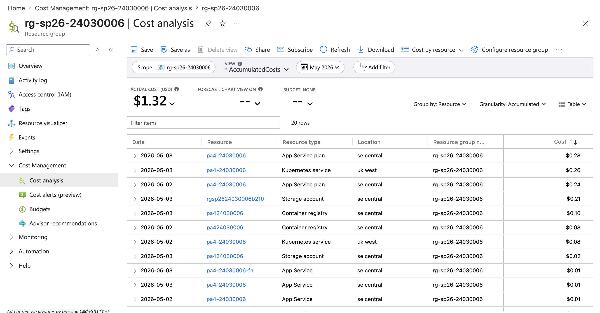

Description: This Azure portal Cost Analysis screenshot is scoped to resource group `rg-sp26-24030006` and shows the May 2026 accumulated-cost view grouped by resource, with a total actual cost of `$1.32`. The highest visible rows are the App Service plan (`$0.28`) and the Kubernetes service (`$0.26`), followed by storage and ACR entries, which shows that the main cost came from always-on infrastructure rather than from short-lived ACI report jobs or small blob usage.

### Question 8.6: Challenges Faced

1. The first major issue was Web App deployment. Azure's generated GitHub Actions workflow tried to run `npm install` at the repository root and failed with `ENOENT` because the real `package.json` lives inside `webapp/`. I confirmed that from the GitHub Actions logs, replaced the generated workflow with a manual workflow that builds from `webapp/`, and kept the deployment centered on the correct folder.

2. The second major issue was Function App host storage. The initial `AzureWebJobsStorage` configuration used a connection-string path that depended on key-based authentication, but the storage account disallowed shared-key access, so the Function host would not start cleanly and the functions would not enumerate correctly. I switched the Function App to managed-identity-based host storage settings, verified the correct identity path, and confirmed the fix when Azure indexed all four handlers and the starter/orchestrator requests began working again.

3. The third issue was report PDF access. The report generator wrote the PDF successfully, but opening the plain blob URL failed because anonymous blob access kept reverting to disabled at the storage-account level. After confirming that public access would not stay enabled, I changed `report_activity` to return a time-limited SAS URL instead of a raw blob URL, rebuilt the Function App container, redeployed it with a fresh image tag, and verified that the signed URL returned `200 OK`.

---
